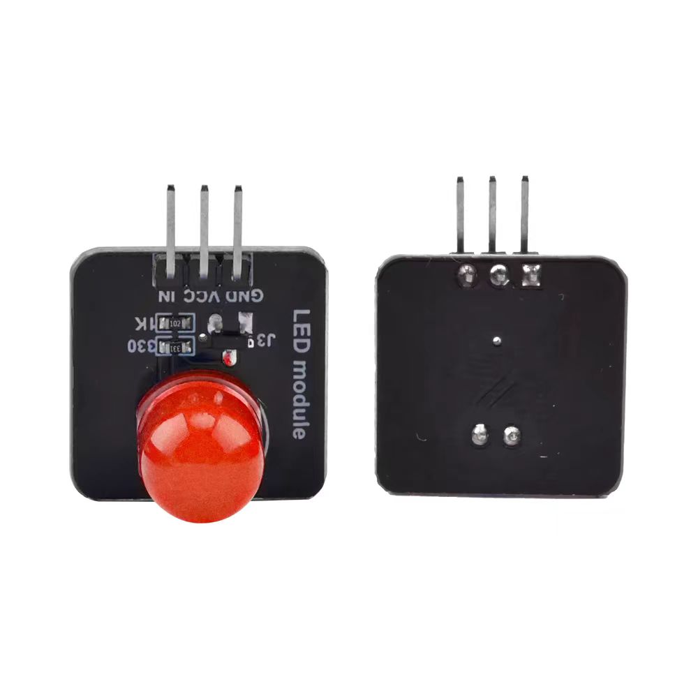
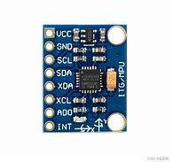

## 实验一: 基础设备控制

基础设备控制实验着眼于RIOT的多线程控制，基于GPIO引脚输出的LED灯控制以及基于I2C总线的IMU传感器数据读取。最终目标是根据设备的姿态展示不同的LED显示状态。

### 实验目标：

- 理解RIOT操作系统的多线程控制原理和方法。
- 掌握基于GPIO引脚的LED灯控制技术。
- 学习通过I2C总线读取IMU传感器数据的方法。
- 实现根据设备姿态展示不同LED显示状态的功能。

### 一、RIOT-OS 多线程使用
#### (1) 程序执行
`00_threads/`提供一个基于多线程的工作调度案例，要使用线程，**需要给每个线程单独分配空间**。
执行案例。
```bash
esp_idf all
# sudo chmod 777 /dev/ttyUSB*
cd ~/RIOT/examples/emnets_experiment/00_threads/
# 正常执行以下编译命令即可
make BOARD=esp32-wroom-32 flash term

# 基于容器的编译链
BUILD_IN_DOCKER=1 DOCKER="sudo docker" \
   DOCKER_IMAGE=schorcht/riotbuild_esp32_espressif_gcc_8.4.0 \
   make BOARD=esp32-wroom-32 flash
```
#### (2) 多线程介绍
下面是官方给的[基本案例](https://doc.riot-os.org/group__core__thread.html).
首先，为线程rcv_thread预先分配了堆栈内存`rcv_thread_stack`，然后实现了线程的函数`*rcv_thread`, 通过在`main()`中调用`thread_create()`来创建`rcv_thread`。它的优先级为`THREAD_PRIORITY_MAIN - 1`，即比主线程的优先级略高(优先级值越小，优先级越高)，设置为`THREAD_CREATE_STACKTEST`标志，线程会立刻执行。
```c++
// kernel_pid_t thread_create(char *stack, int stacksize, uint8_t priority,
//                             int flags, thread_task_func_t task_func,
//                             void *arg, const char *name);
#include "thread.h"
char rcv_thread_stack[THREAD_STACKSIZE_MAIN];
void *rcv_thread(void *arg)
{
    (void) arg;
    msg_t m;
    while (1) {
        msg_receive(&m);
        printf("Got msg from %" PRIkernel_pid "\n", m.sender_pid);
    }
    return NULL;
}
int main(void)
{
    thread_create(rcv_thread_stack, sizeof(rcv_thread_stack),
                  THREAD_PRIORITY_MAIN - 1, THREAD_CREATE_STACKTEST,
                  rcv_thread, NULL, "rcv_thread");
}
```
`int msg_receive(msg_t *m);`和`int msg_send(msg_t *m, kernel_pid_t target_pid);`用与两个线程之间的通信。
`msg_receive`会一直等待信息，而`msg_send`可将信息发送到指定的线程。下述为`msg_t`的结构体定义，`sender_pid`会自行定义，其余参数都可灵活用于传递信息，如通过type参数来执行不同的程序(如蓝牙发送、暂定等)。
```c++
typedef struct {
    kernel_pid_t sender_pid;    /**< PID of sending thread. Will be filled in
                                     by msg_send. */
    uint16_t type;              /**< Type field. */
    union {
        void *ptr;              /**< Pointer content field. */
        uint32_t value;         /**< Value content field. */
    } content;                  /**< Content of the message. */
} msg_t;
```
下述的部分案例当中，创建了一个用于调度的线程，在队列加入任务后，通过`msg_send`函数会提醒所有工作节点的线程。
```c++
void *scheduler_thread(void *arg) {
    (void)arg;
    int task_arg1 = 1;
    int task_arg2 = 2;
    while (1) {
        enqueue_task(task_function1, &task_arg1);
        xtimer_sleep(2);
        enqueue_task(task_function2, &task_arg2);
        xtimer_sleep(2);
        for (int i = 0; i < NUM_WORKERS; ++i) {
            msg_t msg;
            msg.content.value = 1;
            msg_send(&msg, worker_pids[i]);
        }
    }
    return NULL;
}
#define THREAD_STACKSIZE        (THREAD_STACKSIZE_IDLE)
static char stack[THREAD_STACKSIZE];
int main(void)
{
    // ....
    char scheduler_stack[STACKSIZE];
    thread_create(scheduler_stack, sizeof(scheduler_stack),
                  THREAD_PRIORITY_MAIN - 1, THREAD_CREATE_STACKTEST,
                  scheduler_thread, NULL, "scheduler");
    return 0;
}
```
RIOT OS 学会线程如何创建、线程间如何通信即可。

### 二、LED灯控制
#### (1) LED灯设备介绍


LED灯只有GND、VCC和IN这三个引脚，GND和VCC接到对应的引脚即可(后续如果引脚不够，可以将GND接到任意低电压的引脚，VCC接到高电压的引脚), IN引脚接到任意一个GPIO引脚，如`GPIO12`引脚。

#### (2) 程序要求
请浏览`03_threads_led/ledcontroller.cpp`和`03_threads_led/ledcontroller.hh`文件的要求并在对应的函数补充代码实现灯控制和自定义闪烁等。

```c++
// 03_threads_led/ledcontroller.cpp
// LED灯控制
void LEDController::update_led(void){
    // input your code
}

// LED灯自定义闪烁
// times 代表闪烁的次数
// delay_time_per_blink 代表一次闪烁的时延
void LEDController::blink_faster(int times, uint32_t delay_time_per_blink) {
    //  input your code
}
```

修改`03_threads_led/main.cpp`的 `LED_GPIO`定义以及`void *_led_thread(void *arg)`函数，完成实验要求。具体实现不限于上述内容，可自行实现。


```c++
// 03_threads_led/main.cpp
#define LED_GPIO GPIO12
LEDController led(LED_GPIO);
void *_led_thread(void *arg)
{
    (void) arg;
    // input your code
    return NULL;
}
```

**实验要求: 每过2秒，LED灯以每次闪烁100ms的时延闪烁5次。**

#### (3) 编译程序

```bash
esp_idf all
# sudo chmod 777 /dev/ttyUSB*
cd ~/RIOT/examples/emnets_experiment/03_threads_led/
# 正常执行以下编译命令即可
make BOARD=esp32-wroom-32 flash term

# 基于容器的编译链
BUILD_IN_DOCKER=1 DOCKER="sudo docker" \
   DOCKER_IMAGE=schorcht/riotbuild_esp32_espressif_gcc_8.4.0 \
   make BOARD=esp32-wroom-32 flash
```

#### (4) 补充:
1. 引脚模式:`int gpio_init(gpio_t pin, gpio_mode_t mode);` 初始化GPIO引脚(如`GPIO12`)的工作模式，目前支持6种工作模式，具体参考下面内容，本实验只需要通过输出电压来控制LED灯，因此设置为`GPIO_OUT`即可。
```c++
typedef enum {
    GPIO_IN    = GPIO_MODE(0, 0, 0),    /**< input w/o pull R */
    GPIO_IN_PD = GPIO_MODE(0, 2, 0),    /**< input with pull-down */
    GPIO_IN_PU = GPIO_MODE(0, 1, 0),    /**< input with pull-up */
    GPIO_OUT   = GPIO_MODE(1, 0, 0),    /**< push-pull output */
    GPIO_OD    = GPIO_MODE(1, 0, 1),    /**< open-drain w/o pull R */
    GPIO_OD_PU = GPIO_MODE(1, 1, 1)     /**< open-drain with pull-up */
} gpio_mode_t;
```
2. 引脚状态设置。RIOT控制引脚电压有两种方式。

(1) 方法一

`void gpio_write(gpio_t pin, int value);` value 为0时，引脚为低电压，value为1时, 引脚为高电压。

(2) 方法二

`void gpio_set(gpio_t pin);` 将引脚pin设置为高电压。

`void gpio_clear(gpio_t pin);` 将引脚pin设置为低电压。


**ledcontroller.cpp** 和 **ledcontroller.hh**后续项目都要用到，之后要用，记得都要复制一份。

### 三、IMU惯性传感器使用及LED展示

该环节代码处于`04_threads_led_and_imu`，复制一份上一环节得到的led灯控制源代码和头文件到此文件夹下。

#### (1) MPU6050驱动程序使用介绍

MPU6050的驱动程序已经写好，直接使用即可，后续使用MPU6050时，`main.cpp`目录下，放置一份`mpu6050.cpp`和`mpu6050.h`程序即可。
```c++
// 创建MPU6050驱动
MPU6050 mpu; 
// 驱动初始化，默认即可
mpu.initialize();
// 获取MPU6050当前角加速度的量程(默认是2000度/s^2)和加速度的量程(2g m/s^2, 两倍重力加速度.), 可在initialize()里面修改.
uint8_t gyro_fs = mpu.getFullScaleGyroRange();
uint8_t accel_fs_g = mpu.getFullScaleAccelRange();

// 获取当前三个轴的加速度和角加速度
int16_t ax, ay, az, gx, gy, gz;
mpu.getMotion6(&ax, &ay, &az, &gx, &gy, &gz);
```
#### (2) 设备连接


MPU6050只需要连接VCC、GND、SCL和SDA四个引脚即可。SCL连接到ESP32-WROOM-32的`GPIO22`处，SDA引脚连接到ESP32-WROOM-32的`GPIO21`处。

#### (3) 代码补充
补充`detectMovement`函数，实现根据当前信息判断设备姿态**平放静止**`Stationary`,**倾斜**`Tilted`, **翻转**`Rotating`, **移动**`moving`.
同时研究 `_imu_thread`函数，学习MPU6050的驱动使用，任意修改该函数和_led_thread函数。 
```c++
// 自定义个函数
MoveState detectMovement(MPU6050Data &data)
{
    // input your code
}
void *_imu_thread(void *arg);
```

最终达到的效果是，设备**平放静止**灯不亮，**倾斜**灯常亮，**翻转**灯快速闪烁，**移动**灯慢闪烁。
