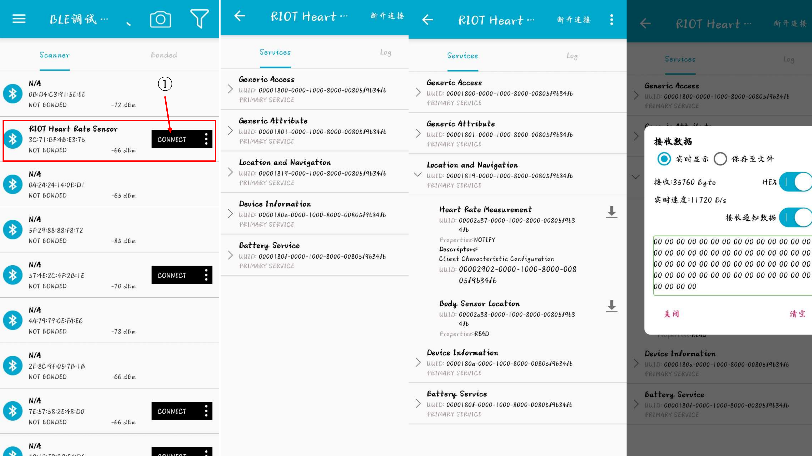

## 实验二: BLE nimble GATT 通信
本部分实验将深入探讨使用BLE nimble库实现通用属性配置文件（GATT）通信。GATT是BLE协议栈中用于设备服务和特性管理的架构，它支持设备间的数据交互。通过本实验，学生将学习如何定义、配置和使用GATT服务和特性，以实现复杂的数据交互和设备控制功能。

### 实验目标：
- 理解BLE GATT协议的结构和功能。
- 掌握如何使用BLE nimble库定义和管理GATT服务和特性。
- 学习如何通过GATT特性进行数据的读取和写入。
- 实现一个能够通过GATT服务交换数据的BLE设备。

### 


###
#### (1) 程序执行
```bash
cd ~/RIOT/examples/emnets_experiment/10_nimble_server/
# sudo chmod 777 /dev/ttyUSB*
esp32_idf all
make BOARD=esp32-wroom-32 flash term
```
> 2024-05-27 14:48:11,300 # Connect to serial port /dev/ttyUSB0  
Welcome to pyterm!  
Type '/exit' to exit.  
2024-05-27 14:48:12,313 # main(): This is RIOT! (Version: 2024.04-devel-480-gd76fc)  
2024-05-27 14:48:12,314 # NimBLE Heart Rate Sensor Example  


#### (2) 手机蓝牙调试工具
`BLE调试助手` `nRF Connect`等市场上通行的BLE调试工具都可以。
以`BLE调试助手`APP 为例。
按下面图片流程执行即可，连接蓝牙名为`RIOT Heart Rate Senser`的蓝牙，后续找到`Heart Rate Measurement`服务名，开始接受数据。


#### 实验要求
更改`10_nimble_server/` `cfg.adv_itvl_ms`等参数，自定义一个服务，如图片下载等，最终记录不同参数对实时传输速度的影响。