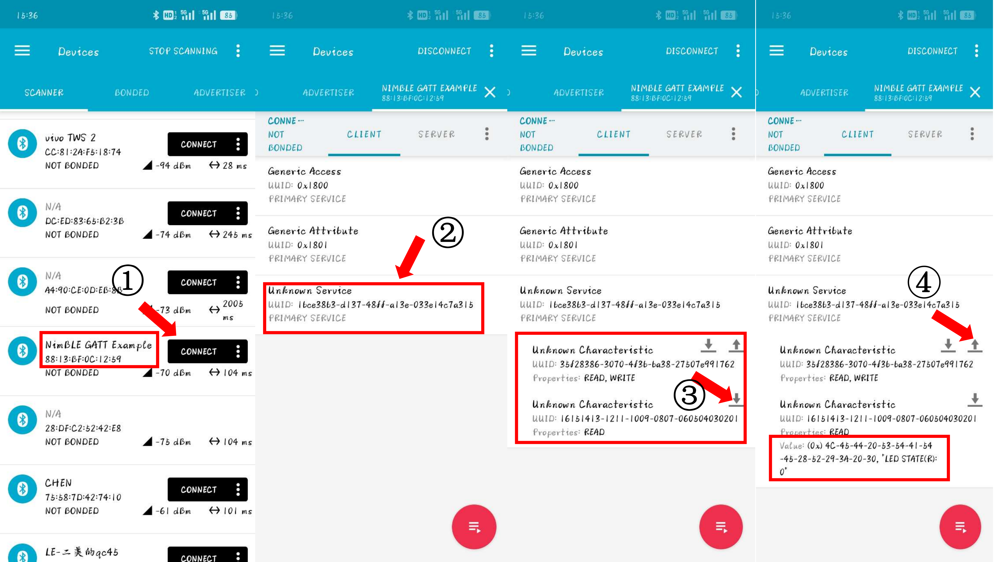
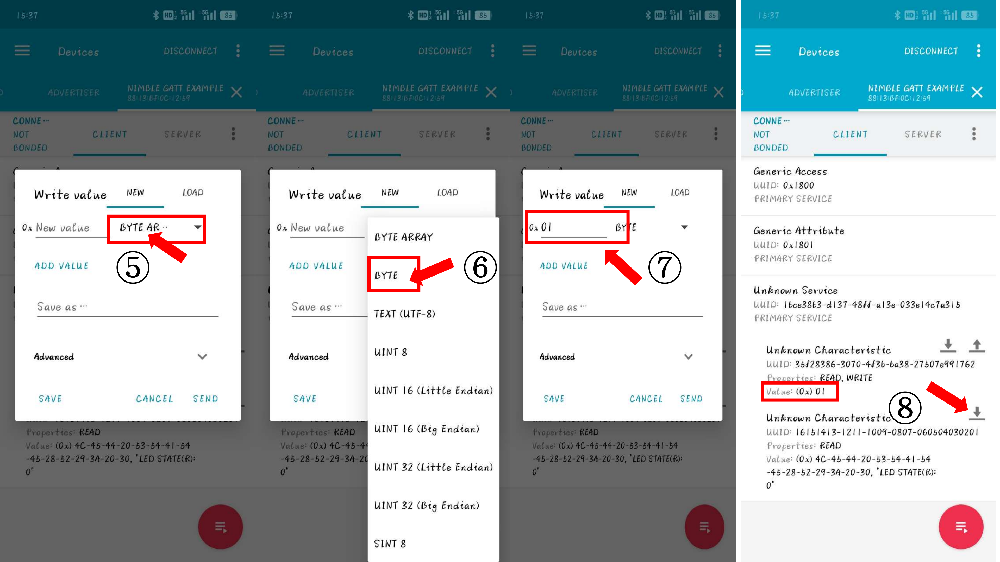
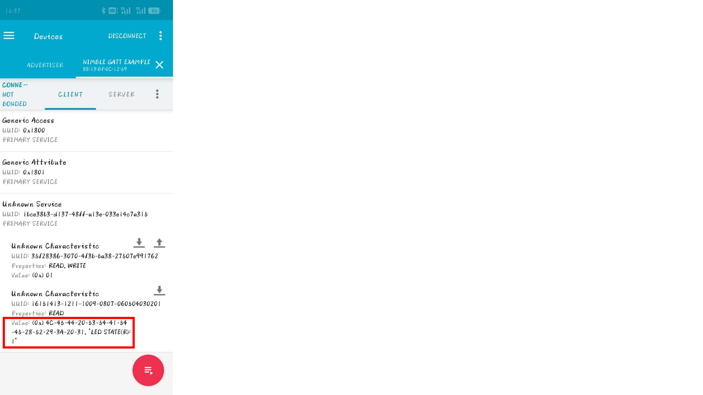

## 实验三: BLE nimble GATT 通信
本部分实验将深入探讨使用BLE nimble库实现通用属性配置文件（GATT）通信。GATT是BLE协议栈中用于设备服务和特性管理的架构，它支持设备间的数据交互。通过本实验，学生将学习如何定义、配置和使用GATT服务和特性，以实现复杂的数据交互和设备控制功能，最终展示成果需要结合整合前面两个实验，手机端可获取设备的数据(如传感器数据，设备运动状态)，也能发送数据到设备端，设备在线作出一定反馈操作(如用户发送设备模型识别的阈值或识别的频率，设备需要更新模型识别阈值以及频率)。

### 实验目标：
- 理解BLE GATT协议的结构和功能。
- 掌握如何使用BLE nimble库定义和管理GATT服务和特性。
- 学习如何通过GATT特性进行数据的读取和写入。
- 实现一个能够通过GATT服务交换数据的BLE设备。
### 案例: 通过GATT服务器获取并控制LED DEMO
`20_nimble_gatt`案例在设备上创建一个NIMBLE GATT服务器，该服务器创建一个可读写以及一个只读的特性，用户可以在任何设备如(PC,手机端,支持蓝牙的开发板等)，通过蓝牙连接该服务器，访问这两个特性，通过特性读取数据或写入数据。通过该案例，希望同学们学会如何创建可读写自定义特性的GATT服务器。

#### (1) 运行案例
```bash
esp_idf all
# sudo chmod 777 /dev/ttyUSB*
cd ~/RIOT/examples/emnets_experiment/20_nimble_gatt/
# 正常执行以下编译命令即可
make BOARD=esp32-wroom-32 flash term
# 注意每次烧写完，点击ESP32左侧reset按钮
```
完成上述操作后，终端串口会打印以下信息:
> 2024-08-08 15:30:59,695 # main(): This is RIOT! (Version: 2024.10-devel-39-g340caa)  
> 2024-08-08 15:30:59,698 # NimBLE GATT Server Example   
> 2024-08-08 15:30:59,704 # LED Controller initialized with (RGB: GPIO26, GPIO25, GPIO27)  
> 2024-08-08 15:30:59,706 # [LED_THREAD] WAIT  
> 2024-08-08 15:30:59,706 # [MAIN] LED_PID: 6  

接下来需要用到手机或者电脑与之通信，不同手机系统的同学请看对应部分进行后续操作。
##### 基于安卓系统的手机 
手机的操作系统属于Android, 请安装`20_nimble_gatt/nRFConnect_4_28_1.apk` APP。
1) 打开nRFConnect APP，找到蓝牙名为**NimBLE GATT Example**的蓝牙, 同时留意蓝牙名下面的MAC地址，图中是**88:13:BF:0C:12:59**, **操作一:点击`CONNECT`，与ESP32服务器蓝牙建立连接**。
2) 找到第三个服务，其UUID为`1bce38b3-d137-48ff-a13e-033e14c7a315`,**操作二：点击该服务**。
3) 该服务，会显示两个特性，第一个特性，UUID为`35f28386-3070-4f3b-ba38-27507e991762`，其特性为可读可写(`READ, WRITE`)；第二个特性，UUID为`16151413-1211-1009-0807-060504030201`，其特性为只可读(`READ`)。箭头朝上表示写，朝下表示读。**操作三：点击第二特型上的箭头(朝下)，将请求读取LED灯状态**。
4) 操作三后，红框处，服务三的第二个特性`value`更新，内容包含**"LED STATE(R):0"**, 读完成。**操作四： 点击第一个特性的朝上箭头进行写操作，请求设置LED灯状态。**
 
5) **操作五：在弹出的写操作页面，点击 `BYTE AR...`**
6) **操作六：选择单位为`BYTE`**，这些单位按字面意思就能理解。
7) **操作七：在单位前的横线输入01**, 并点击`SEND`按钮，发送信息。
8) 上一操作完成后，可以发现第一个特性的`Value`更新为(0x)01, 此时留意ESP32连接的LED RGB模块，红灯亮起。 **操作八：点击第二个特性的读箭头**，第二个特性的`Value`内容更新，包含**"LED STATE(R):1"**。


 



后续，请参考上述操作，发送0x00数据(注意两个0)，关闭LED灯。请留意上述提到的所有`UUID`。


#### (2) 案例代码解释


#### 实验要求
更改`10_nimble_server/` `cfg.adv_itvl_ms`等参数，自定义一个服务，如图片下载等，最终记录不同参数对实时传输速度的影响。
