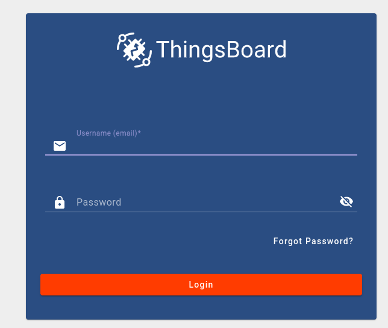
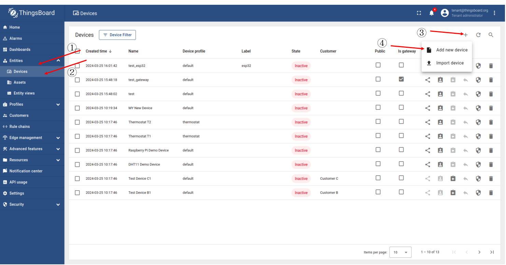
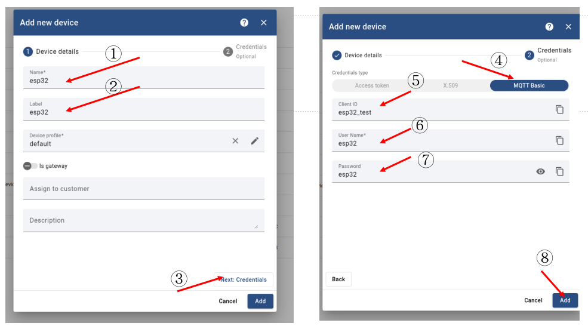
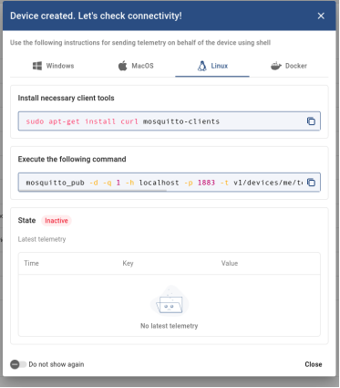
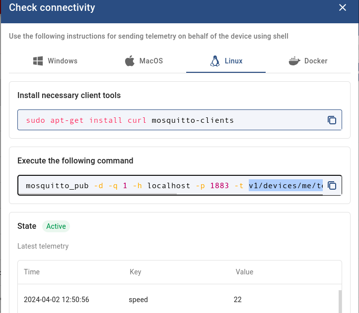

## 实验三： 基于MQTT的ThingsBoards物联网设备管理
ThingsBoard是用于数据收集、处理、可视化和设备管理的开源物联网平台。它通过行业标准的物联网协议：MQTT、CoAP、SNMP、LWM2M、Modbus、OPC UA和HTTP实现设备连接并支持私有云和本地部署；ThingsBoard具有弹性伸缩、高容错性和性能极致的特点保证永远不会丢失数据。本次实验采取MQTT的方式实现ESP32连接ThingsBoard平台。需要在电脑端完成ThingsBoard的安装和配置，实现ESP32连接平台并数据上传。

### 实验目标:

- 理解MQTT协议，包结构。
- 学会使用ThingsBoards平台包括不限于数据图形化。
- 实现物联网设备数据定期上传。


### 一、ThingsBoard平台搭建

[ThingsBoard官方](http://www.ithingsboard.com/docs/)提供了社区版、专业版和云服务这三种平台类型，支持Linux、树梅派3、win10等系统，并给出了详细的文档可供学习。ThingsBoard目前支持Ubuntu 18.04 和 Ubuntu 20.04(Ubuntu 22.04经测试也可以)。详细文档可参考[官网教程](http://www.ithingsboard.com/docs/user-guide/install/ubuntu/)。
本次安装ThingsBoard社区版本，给出ubuntu系统的安装教程, 包括容器和本地两种安装方式。

#### (1) 基于Docker的ThingsBoard安装 (**推荐**)

docker 安装前面[RIOT安装环境](./README.md)里面就有提到过，官方已经提供了一个可直接使用的ThingsBoard镜像。使用容器版的ThingsBoard教程可参考[官方文档](http://www.ithingsboard.com/docs/getting-started-guides/helloworld/)。

```bash
mkdir -p ~/.mytb-data && sudo chown -R 799:799 ~/.mytb-data
mkdir -p ~/.mytb-logs && sudo chown -R 799:799 ~/.mytb-logs
sudo docker run -it -p 8080:9090 -p 7070:7070 -p 1883:1883 \
    -p 5683-5688:5683-5688/udp -v ~/.mytb-data:/data \
    -v ~/.mytb-logs:/var/log/thingsboard \
    --name mytb --restart always \
    thingsboard/tb-postgres
```
你可以通过ThingsBoard页面地址http://localhost:8080、 用户名tenant@thingsboard.org和密码tenant进行访问， 有关模拟帐户请参见[此处](http://www.ithingsboard.com/docs/samples/demo-account/)。如何之前mosquitto占用了1883端口，可关闭mosquitto，或者将上述-p 1883:1883 改成你自定义的端口如 -p 11883:1883，先运行下面删除容器，然后再重新运行上述指令。

```bash
sudo docker rm -vf mytb
```

#### (2) 本地安装 (**不推荐**)

1. 输入以下指令，完成java11的安装

```bash
sudo apt update
sudo apt install -y openjdk-11-jdk
sudo update-alternatives --config java
java --version
```

输出以下，java11安装成功。

> openjdk version "11.0.xx"  
OpenJDK Runtime Environment (...)  
OpenJDK 64-Bit Server VM (build ...)  

2. 安装ThingsBoard服务

```bash
cd ~
mkdir ThingsBoard
cd ThingsBoard
sudo apt install -y wget
wget https://github.com/thingsboard/thingsboard/releases/download/v3.5.1/thingsboard-3.5.1.deb
sudo dpkg -i thingsboard-3.5.1.deb
```

3. 配置数据库

直接安装PostgreSQL最为便利。

```bash
# install **wget** if not already installed:
sudo apt install -y wget lsb-release nano

# import the repository signing key:
wget --quiet -O - https://www.postgresql.org/media/keys/ACCC4CF8.asc \
    | sudo apt-key add -

# add repository contents to your system:
RELEASE=$(lsb_release -cs)
echo "deb http://apt.postgresql.org/pub/repos/apt/ ${RELEASE}"-pgdg main \
    | sudo tee  /etc/apt/sources.list.d/pgdg.list

# install and launch the postgresql service:
sudo apt update
sudo apt -y install postgresql-12
sudo service postgresql start
```

为数据库用户设置密码。

```bash
sudo su - postgres
psql
\password
# 需要你输入密码
\q
# 退出
```

按“Ctrl+D”返回控制台并连接到数据库创建ThingsBoard数据库，并配置数据库。

```bash
psql -U postgres -d postgres -h 127.0.0.1 -W
# 需要输入密码
CREATE DATABASE thingsboard;
\q

sudo nano /etc/thingsboard/conf/thingsboard.conf
```

将下面内容添加到配置文件中并**替换“PUT_YOUR_POSTGRESQL_PASSWORD_HERE”为postgres帐户密码**：然后CTRL+X， 确认保存Y，最后回车即可退出nano。

```bash
# DB Configuration 
export DATABASE_TS_TYPE=sql
export SPRING_DATASOURCE_URL=jdbc:postgresql://localhost:5432/thingsboard
export SPRING_DATASOURCE_USERNAME=postgres
export SPRING_DATASOURCE_PASSWORD=PUT_YOUR_POSTGRESQL_PASSWORD_HERE
# Specify partitioning size for timestamp 
# key-value storage. Allowed values: DAYS, MONTHS, YEARS, INDEFINITE.
export SQL_POSTGRES_TS_KV_PARTITIONING=MONTHS
```

4. 运行安装脚本
执行以下脚本安装ThingsBoard服务并初始化演示数据：
```bash
# --loadDemo option will load demo data: users, devices, assets, rules, widgets.
cd ~
sudo /usr/share/thingsboard/bin/install/install.sh --loadDemo
```
出现以下内容，即完成ThingsBoard服务安装和初始化:
> ......  
Loading demo data...  
Installation finished successfully!  
ThingsBoard installed successfully!  

5. 启动服务

```bash
sudo service thingsboard start
```

打开浏览器，访问http://localhost:8080/, 
如果在安装脚本的执行过程中指定了-loadDemo则可以使用以下默认帐号:
- System Administrator: sysadmin@thingsboard.org / sysadmin
- Tenant Administrator: tenant@thingsboard.org / tenant
- Customer User: customer@thingsboard.org / customer


### 二、 ThingsBoard 使用
打开浏览器，访问http://localhost:8080/, 输入Tenant Administrator默认账户其中一个即可。
可以使用以下默认帐号:
- System Administrator: sysadmin@thingsboard.org / sysadmin
- Tenant Administrator: tenant@thingsboard.org / tenant
- Customer User: customer@thingsboard.org / customer

<div style="text-align: center;">
  <figure>
    
    <figcaption>登陆页面</figcaption>
  </figure>
</div>

1. 登录并打开设备页面
2. 单击Entities
3. 单击Devices
4. 点击+，并点击Add new device

<div style="text-align: center;">
  <figure>
    
    <figcaption>设备主页</figcaption>
  </figure>
</div>

以下操作是添加设备，里面的信息都是自己定义，需要记住，后续要使用。  
1. 填写Name，这里demo可输入esp32
2. 填写Label
3. 点击Next: Credentials
4. 点击MQTT Basic
5. 填写ClientID
6. 填写User Name
7. 填写Password
8. 完成添加  

<div style="text-align: center;">
  <figure>
    
    <figcaption>设备添加</figcaption>
  </figure>
</div>

完成上述操作，可显示以下窗口，可先用本地电脑尝试下连接。

<div style="text-align: center;">
  <figure>
    
    <figcaption>连接检测</figcaption>
  </figure>
</div>

### 三、ThingsBoard 连通测试
主机命令行安装mosquitto客户端，进行连通测试
```bash
sudo apt-get install curl mosquitto-clients
mosquitto_pub -d -q 1 -h localhost -p 1883 -t v1/devices/me/telemetry -i "esp32_test" -u "esp32" -P "esp32" -m "{temperature:25}"
```
- -d: 显示日志
- -q: Quality of service level
- -h: 主机IP, 如果是其他设备访问，需要更改为真实的IP
- -p: MQTT 端口，这里默认是1883
- -t: mqtt topic to publish to, 比如v1/devices/me/telemetry, v1/devices/me/attributes
- -i：前面定义的Client ID
- -u:  前面定义的User Name
- -P：前面定义的密码Password
- -m: 要发的信息

完成发送后，命令行会显示, 且刚才那个窗口会显示temperature 信息

> Client esp32_test sending CONNECT  
Client esp32_test received CONNACK (0)  
Client esp32_test sending PUBLISH (d0, q1, r0, m1, 'v1/devices/me/telemetry', ... (16 bytes))  
Client esp32_test received PUBACK (Mid: 1, RC:0)  
Client esp32_test sending DISCONNECT  

### 四、ESP32连接ThingsBoard官网案例

```bash
cd ~/RIOT/
# sudo chmod 777 /dev/ttyUSB*
esp_idf all
make BOARD=esp32-wroom-32 LWIP_IPV4=1 \
 WIFI_SSID="WIFI账户" WIFI_PASS="WIFI密码" \ 
 flash term -C examples/paho-mqtt/
 
# 基于容器的方法(esp32工具链)
BUILD_IN_DOCKER=1 DOCKER="sudo docker" \
DOCKER_IMAGE=schorcht/riotbuild_esp32_espressif_gcc_8.4.0 \
make BOARD=esp32-wroom-32 LWIP_IPV4=1 \
    WIFI_SSID="WIFI账户" WIFI_PASS="WIFI密码" \ 
    flash term -C examples/paho-mqtt/
```

esp32 终端最终会打印类似以下的信息。
> 2024-04-02 12:38:40,075 # Pro cpu up.  
2024-04-02 12:38:40,075 # Single core mode  
2024-04-02 12:38:40,076 # Initializing. RAM available for dynamic allocation:  
2024-04-02 12:38:40,076 # At 3FFAE6E0 len 00001920 (6 KiB): DRAM  
2024-04-02 12:38:40,077 # At 3FFBCCC0 len 00023340 (140 KiB): DRAM  
2024-04-02 12:38:40,077 # At 3FFE0440 len 0001FBC0 (126 KiB): D/IRAM  
2024-04-02 12:38:40,078 # At 40078000 len 00008000 (32 KiB): IRAM  
2024-04-02 12:38:40,079 # At 400970D4 len 00008F2C (35 KiB): IRAM  
2024-04-02 12:38:40,079 #  
2024-04-02 12:38:40,080 # main(): This is RIOT! (Version: 2024.04-devel-480-gd76fc)  
2024-04-02 12:38:40,437 # Running mqtt paho example. Type help for commands info  
2024-04-02 12:38:41,591 # WiFi connected to ssid EmNets-301, channel 1  

需要等待一会，然后输入`ifconfig`，查看是否获得IP  
> 2024-04-02 12:38:41,591 # WiFi connected to ssid EmNets-301, channel 1  
ifconfig  
2024-04-02 12:40:01,284 # ifconfig  
2024-04-02 12:40:01,287 # Iface ET0 HWaddr: ec:64:c9:90:9a:94 Link: up State: up  
2024-04-02 12:40:01,290 #         Link type: wireless  
2024-04-02 12:40:01,297 #         inet addr: 192.168.31.216 mask: 255.255.255.0 gw: 192.168.31.1  

需要提前知道你ThingsBoard部署的主机IP,如192.168.31.229
以下命令都是在与ESP32端口交互的命令行内执行的。
1. 连接MQTT con
```bash
con  <broker ip addr> [port] [clientID] [user] [password] [keepalivetime]
con  <broker ip addr> [port] [clientID] [user] [password] [keepalivetime]]
sub <topic name> [QoS level]
pub <topic name> <string msg> [QoS level]

con 192.168.31.229 1883 esp32_test esp32 esp32
```
以下是con连接的反馈日志，连接成功:

> 2024-04-02 12:43:04,524 # mqtt_example: Connecting to MQTT Broker from 192.168.31.229 1883  
2024-04-02 12:43:04,529 # mqtt_example: Trying to connect to 192.168.31.229, port: 1883  
2024-04-02 12:43:04,534 # user:esp32 clientId:esp32_test password:esp32, esp32_test  
2024-04-02 12:43:04,538 # addr_ip:192.168.31.229  
2024-04-02 12:43:04,756 # mqtt_example: Connection successfully  

2. 订阅服务 sub
```bash
con 192.168.31.229 1883 esp32_test esp32 esp32
sub v1/devices/me/telemetry 1
# 1是QOS level
```
需要注意，MQTT连接很快就会断的，如果sub等操作显示disconect，需要重新输入con的那条指令

> 2024-04-02 12:47:42,074 # sub v1/devices/me/telemetry 2  
2024-04-02 12:47:42,080 # mqtt_example: Subscribing to v1/devices/me/telemetry  
2024-04-02 12:47:42,460 # mqtt_example: Now subscribed to v1/devices/me/telemetry, QOS 2  

3. 发送信息 pub

```bash
con 192.168.31.229 1883 esp32_test esp32 esp32
pub v1/devices/me/telemetry "{speed:22}" 1
```
> pub v1/devices/me/telemetry "{speed:22}" 1  
2024-04-02 12:50:56,669 # pub v1/devices/me/telemetry "{speed:22}" 1  
2024-04-02 12:50:56,923 # mqtt_example: Message ({speed:22}) has been published to topic v1/devices/me/telemetrywith QOS 1  
<div style="text-align: center;">
  <figure>
    
    <figcaption>连通测试</figcaption>
  </figure>
</div>
平台也显示刚刚发送的信息。到这里，案例就可以结束了。自行修改examples/paho-mqtt路径下的文件main.c，实现更多功能，比如定期发送温度传感器读取到的温度值。


### 五、实验内容
通过前面案例，不难发送我门发送数据需要以`{}`json字符串数据格式发送，同时将案例转化为CPP的形式，一些基础代码也需要修改，请在`20_mqtt_thingsboard_custom/`文件夹实现以下功能，参考同文件夹下的`mqtt_thingsboard.cpp`和`mqtt_thingsboard.hh`对应位置的注释要求，实现mqtt与thingsboard的连接要求，数据上传，连接断开等功能。
```c++
int MQTT_Thingsboard::mqtt_connect(MQTTPacket_connectData &data, std::string remote_ip, int port){
    // Your code here.
    return 0;
}
int MQTT_Thingsboard::mqtt_disconnect(){
    // Your code here.
    return 0;
}

int MQTT_Thingsboard::mqtt_publish(MQTTMessage &msg, std::string topic){
    // Your code here.
    return 0;
}
```

同时修改同目录下的`main.cpp`文件，补充`void *_publish_thread(void *arg)`函数，实现MPU6050数据定期上传。
**Note:** 一些宏定义，WIFI IP等需要修改，可根据各自喜好修改包括不限于上述提到的所有内容。
注意ledcontroller的文件需要替换成前面实验各自对应的文件。
```bash
esp32_idf all
cd ~/RIOT/
# sudo chmod 777 /dev/ttyUSB*
make BOARD=esp32-wroom-32 LWIP_IPV4=1 \
 WIFI_SSID="WIFI账户" WIFI_PASS="WIFI密码" \ 
 flash term -C examples/emnets_experiment/20_mqtt_thingsboard_custom/

# 基于容器的方法(esp32工具链)
BUILD_IN_DOCKER=1 DOCKER="sudo docker" \
DOCKER_IMAGE=schorcht/riotbuild_esp32_espressif_gcc_8.4.0 \
make BOARD=esp32-wroom-32 LWIP_IPV4=1 \
    WIFI_SSID="WIFI账户" WIFI_PASS="WIFI密码" \ 
    flash term -C examples/emnets_experiment/20_mqtt_thingsboard_custom/
```

建议自行查看`MQTTPacket_connectData`、`MQTTClient`、`Network`等结构体以及对应的函数。
