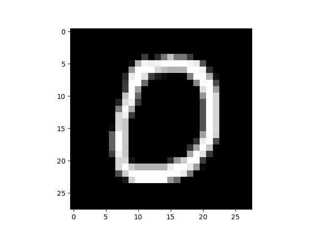

# 实验四: 基于TinyML进行设备姿态识别
在最终实验中，我们将整合前面所有实验，利用TinyML实现ESP32设备的姿态识别。通过训练和部署轻量级的机器学习模型，判断设备的当前运动状态。

### 实验目标：

- 了解TinyML的基本概念及其在嵌入式设备上的应用。
- 掌握模型训练、优化和部署的基本流程。
- 实现基于TinyML的姿态识别系统，判断ESP32设备的运动状态。


### TinyML 案例: 手写字识别

面是RIOT TinyML 案例下个各个文件以及含义。
> tests/pkg/tflite-micro/  
|-- Makefile                    
|-- Makefile.ci  
|-- README.md  
|-- external_modules                # 自定义模块  
|--|-- mnist                        # 手写字识别  
|--|--|-- Makefile                 # 定义了一个mnist模块，并加入模型和数据  
|--|--|-- digit                     # 模型识别输入的数据案例，默认是张数字7的图  
|--|--|-- generate_digit.py         # 生成digit的代码  
|--|--|-- main_functions.cc         # 类似Arduino风格的函数，包括模型导入和模型预测（关键）  
|--|--|-- mnist_mlp.py             # 模型训练和保存  
|--|--|-- model.tflite                # 已经训练好的模型  
|-- main.cpp                        # 主函数，很简单，可忽略  
|-- tests       
|--|-- 01-run.py  

从上述内容，不难看出，在烧给开发板的时候，模型已经是训练好的，数据可以是加载的，也可以是开发板通过传感器(iMU, 温度传感器，触感传感器等)获取的数据。

#### (1) 安装tensorflow 环境
```bash
sudo apt update && sudo apt install -y python3-pip vim
python3 -m pip install numpy==1.24.0 matplotlib tensorflow \
    -i https://pypi.tuna.tsinghua.edu.cn/simple
```
#### (2) 运行案例
执行generate_digit.py 程序，使用数据集里面的第11张图片(即index=10, 从0开始的)， 创建digit文件，并获悉该图片的数字。
```bash
cd ~/RIOT/
cd tests/pkg/tflite-micro/external_modules/mnist/
python3 generate_digit.py --index 10 
```
<div style="text-align: center;">
  <figure>
    
  </figure>
</div>

可以看出数据集第11张图数字是0。
模型训练, 以mnist为例，tests/pkg/tflite-micro/external_modules/mnist/mnist_mlp.py 提供一个多层感知机，从训练到测试，再到轻量化处理。可直接运行该文件即可训练模型。
```bash
cd ~/RIOT/tests/pkg/tflite-micro/external_modules/mnist
python3 mnist_mlp.py
```
> Epoch 27/30 1563/1563 - 2s - loss: 0.0539 - accuracy: 0.9813 - val_loss: 0.1023 - val_accuracy: 0.9763 - 2s/epoch - 1ms/step  
Epoch 28/30 1563/1563 - 3s - loss: 0.0533 - accuracy: 0.9822 - val_loss: 0.0983 - val_accuracy: 0.9766 - 3s/epoch - 2ms/step  
Epoch 29/30 1563/1563 - 3s - loss: 0.0507 - accuracy: 0.9826 - val_loss: 0.1041 - val_accuracy: 0.9748 - 3s/epoch - 2ms/step  
Epoch 30/30 1563/1563 - 2s - loss: 0.0519 - accuracy: 0.9811 - val_loss: 0.1037 - val_accuracy: 0.9762 - 2s/epoch - 1ms/step  
...  
fully_quantize: 0, inference_type: 6, input_inference_type: FLOAT32, output_inference_type: FLOAT32  
Basic model is 205248 bytes  
Quantized model is 53432 bytes  
Difference is 151816 bytes  
INFO: Created TensorFlow Lite XNNPACK delegate for CPU.  
...  
Digit: 9 - Prediction:  
/[/[0.         0.         0.         0.         0.         0.         0.         0.         0.         0.99609375/]/]  


直接执行以下代码，即可运行手写字案例。


```bash
cd ~/RIOT/
esp_idf esp32
# sudo chmod 777 /dev/ttyUSB*
make BOARD=esp32-wroom-32 flash term -C tests/pkg/tflite-micro/
# 点击esp32 靠左侧的自启动按钮，按照提示输入's'，运行程序
```
> 2024-04-01 13:23:22,264 # Help: Press s to start test, r to print it is ready  
r  
2024-04-01 13:24:19,604 # READY  
s  
2024-04-01 13:24:20,342 # START  
2024-04-01 13:24:20,346 # main(): This is RIOT! (Version: 2024.04-devel-586-g48a8e6)  
2024-04-01 13:24:20,379 # Digit prediction: 0  

通过输出的log，不难发现，模型预测的数字也是0。

*注意： 如果你是容器的编译方法，那么执行以下代码(后续不再提示，只讲本地编译的方法):*
```bash
cd ~/RIOT/
# sudo chmod 777 /dev/ttyUSB*
BUILD_IN_DOCKER=1 DOCKER="sudo docker" \
    DOCKER_IMAGE=schorcht/riotbuild_esp32_espressif_gcc_8.4.0 \
    make BOARD=esp32-wroom-32 flash -C tests/pkg/tflite-micro/
make BOARD=esp32-wroom-32 term -C tests/pkg/tflite-micro/
```


### 实验要求

请后续仔细研究`external_modules/mnist`文件夹下的`main_functions.cc`、`Makefile`以及`generate_digit.py`.
学会**TinyML 模型训练及生成**, **esp32设备中模型导入**，**esp32设备模型推理**。

自行设计基于ESP32和MPU6050的设备姿态识别系统，依靠TinyML, 完成对**平躺静止、倾斜、移动、旋转**等姿态的识别，同时将传感器数据和识别结果上传到Thingsboard平台，可同时控制led，不同的LED状态对应不同设备姿态。功能不限于上述要求，可自由扩展。
